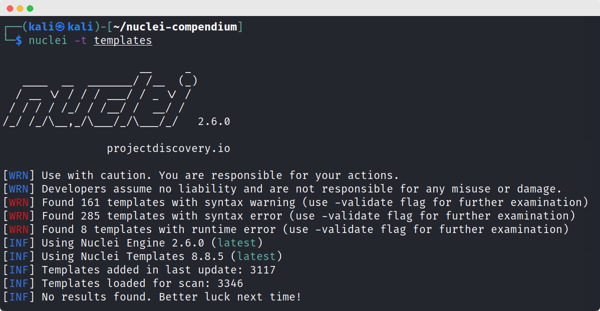

# The Nuclei Compendium

# What
A collection of 3852 nuclei templates from all across github. These are largely sourced from [emadshanab's Nuclei Template Collection list](https://github.com/emadshanab/Nuclei-Templates-Collection). Some of the templates are broken and will need updates to work properly.

# Usage
Add in the template directory with `-t` or copy the `yaml` files into your `~/nuclei-templates/` directory.

# Who
| Author | Contributions |
| :----: | :----: |
| 0x727|2 |
| 1in9e|31 |
| 5cr1pt|1696 |
| ARPSyndicate|3039 |
| AshiqurEmon|11 |
| CharanRayudu|547 |
| clarkvoss|29 |
| d3sca|5 |
| daffainfo|308 |
| esetal|1 |
| ethicalhackingplayground|9 |
| foulenzer|15 |
| geeknik|184 |
| Harish4948|2 |
| im403|172 |
| javaongsan|4 |
| joanbono|11 |
| kabilan1290|7 |
| medbsq|82 |
| meme-lord|53 |
| MR-pentestGuy|19 |
| n1f2c3|1 |
| NitinYadav00|564 |
| notnotnotveg|20 |
| obreinx|1 |
| optiv|42 |
| panch0r3d|18 |
| peanuth8r|2 |
| pikpikcu|221 |
| rafaelcaria|2 |
| rahulkadavil|5 |
| randomstr1ng|10 |
| redteambrasil|2 |
| ree4pwn|2 |
| ResistanceIsUseless|3 | 
| R-s0n|1 |
| sadnansakin|1 |
| Saimonkabir|1 |
| Saptak9983|2 |
| securitytest3r|5 |
| sharathkramadas|3 |
| shifa123|1 |
| smaranchand|3028 |
| Str1am|100 |
| System00-Security|44 |
| test502git|2 |
| thebrnwal|1 |
| thelabda|9 |
| yavolo|2 |
| z3bd|2 |
| zinminphyo0|4 |

# TODO
- [X] Initial cut
- [ ] Make sure these actually work
